# Nischhal Raj Subba

### Product Designer · UX Systems Thinker · Front-end-Aware Builder

**Designing clarity into complex digital products.**

I design Web3 products, SaaS dashboards, fintech experiences, service websites, and design systems that are easier to understand, easier to use, and easier to build.

[Portfolio](https://nischhalsubba.com.np/) · [LinkedIn](https://www.linkedin.com/in/nischhal) · [Behance](https://www.behance.net/nischhal) · [Uxcel](https://app.uxcel.com/ux/nischhal) · [GitHub](https://github.com/Nischhalsubba)

---

## About

I am a product designer from Nepal working across product strategy, UX research, information architecture, interface design, prototyping, design systems, UX audits, accessibility basics, and design-to-development handoff.

My work sits between design and implementation. I care about the product logic behind the screen, the visual system that keeps it coherent, and the technical realities that determine whether it can actually be built.

### I focus on

- **Web3 UX:** wallets, transaction review, signing clarity, trust, onboarding, and product education
- **SaaS UX:** dashboards, tables, filters, statuses, permissions, admin tools, and complex workflows
- **Website UX:** service websites, software landing pages, content hierarchy, SEO-aware structure, and conversion paths
- **Design systems:** reusable components, variants, tokens, states, responsive behavior, documentation, and handoff

---

## Selected Work

| Project | Product area | What it demonstrates |
|---|---|---|
| [nischhalsubba.com.np](https://github.com/Nischhalsubba/nischhalsubba.com.np) | Portfolio platform | Personal brand, case studies, writing, structured content, SEO, and discovery |
| [Nischhal Portfolio 2026](https://github.com/Nischhalsubba/Nischhal-Portfolio-2026) | Portfolio system | Premium product presentation, motion, and case-study storytelling |
| [DesignOps Orchestrator](https://github.com/Nischhalsubba/design-ops-orchestrator) | Design operations | Tokens, audits, content workflows, assets, and release structure |
| [Neverwinter Composition Lab](https://github.com/Nischhalsubba/neverwinter-composition-lab) | Gaming utility | Team planning, information density, role clarity, and support workflows |
| [Neverwinter Live Parser](https://github.com/Nischhalsubba/neverwinter-live-parser) | Desktop analytics | Combat-log interpretation, data-heavy UX, filtering, and comparison |
| [Furniture Website](https://github.com/Nischhalsubba/Furniture_website) | Commerce concept | Editorial storefront, responsive UI, motion, and front-end execution |
| [HR Payroll Management](https://github.com/Nischhalsubba/HR-Payroll-Management) | Business dashboard | Employee onboarding, payroll flows, settings, and admin UX |
| [Napiyo](https://github.com/Nischhalsubba/Napiyo) | Nepal utility | Localized land measurement and unit conversion for Nepali users |

---

## Writing

I write practical product-design notes for designers and builders.

- [Web3 Wallet UX Checklist for First-Time Users](https://nischhalsubba.com.np/blog/web3-wallet-ux-checklist.html)
- [How to Design Transaction Review Screens for Crypto Apps](https://nischhalsubba.com.np/blog/transaction-review-ux-crypto-apps.html)
- [SaaS Dashboard UX Checklist for Complex Workflows](https://nischhalsubba.com.np/blog/saas-dashboard-ux-checklist.html)
- [Website UX Checklist for Software Companies](https://nischhalsubba.com.np/blog/website-ux-checklist-software-companies.html)
- [UX Audit Checklist Before Redesigning a Website](https://nischhalsubba.com.np/blog/ux-audit-checklist-before-redesign.html)
- [How to Write Developer Handoff Notes in Figma](https://nischhalsubba.com.np/blog/figma-handoff-notes-for-developers.html)

[Read all articles](https://nischhalsubba.com.np/blog/)

---

## Toolkit

| Discipline | Tools and capabilities |
|---|---|
| Product design | Figma, FigJam, wireframes, prototypes, research, UX audits, accessibility basics |
| Systems | Design systems, component libraries, variants, tokens, responsive rules, documentation |
| Front end | HTML, CSS, SCSS, JavaScript, TypeScript, React, Next.js, Astro, Vite |
| Motion | GSAP, ScrollTrigger, Framer Motion, microinteraction thinking |
| Web platforms | WordPress, Strapi, static sites, GitHub Pages, Cloudflare Pages, Vercel |
| Workflow | Git, GitHub, QA, documentation, design-development handoff |

---

## GitHub Activity

### Achievements

### Contribution History

<picture>
  <source media="(prefers-color-scheme: dark)" srcset="https://raw.githubusercontent.com/Nischhalsubba/Nischhalsubba/output/github-contribution-grid-snake-dark.svg" />
  <source media="(prefers-color-scheme: light)" srcset="https://raw.githubusercontent.com/Nischhalsubba/Nischhalsubba/output/github-contribution-grid-snake.svg" />
  
</picture>

---

## Principles

- Clarity before cleverness
- Useful before decorative
- Systems over one-off screens
- Honest project storytelling
- Clean developer handoff
- Accessible and responsive by default
- Strong content structure for people and search engines

---

## Connect

- Portfolio: [nischhalsubba.com.np](https://nischhalsubba.com.np/)
- LinkedIn: [linkedin.com/in/nischhal](https://www.linkedin.com/in/nischhal)
- Behance: [behance.net/nischhal](https://www.behance.net/nischhal)
- Uxcel: [app.uxcel.com/ux/nischhal](https://app.uxcel.com/ux/nischhal)
- GitHub: [github.com/Nischhalsubba](https://github.com/Nischhalsubba)

### Design clearly. Build thoughtfully.

