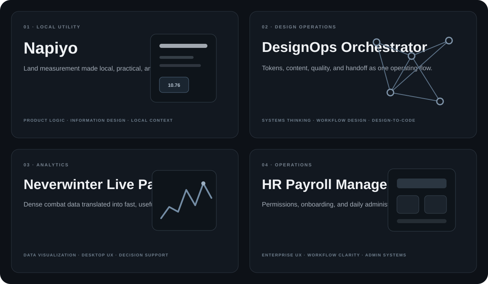
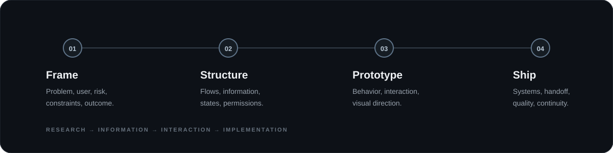

<picture>
  <source media="(prefers-color-scheme: dark)" srcset="./profile/designer-hero-dark.svg">
  <source media="(prefers-color-scheme: light)" srcset="./profile/designer-hero-light.svg">
  
</picture>

  <a href="https://nischhalsubba.com.np/"><strong>Portfolio</strong></a>
  &nbsp;&nbsp;/&nbsp;&nbsp;
  <a href="https://www.behance.net/nischhal"><strong>Behance</strong></a>
  &nbsp;&nbsp;/&nbsp;&nbsp;
  <a href="https://www.linkedin.com/in/nischhal"><strong>LinkedIn</strong></a>
  &nbsp;&nbsp;/&nbsp;&nbsp;
  <a href="https://app.uxcel.com/ux/nischhal"><strong>Uxcel</strong></a>

  
  
  

 

<table>
<tr>
<td width="68%" valign="top">

PROFILE / PRODUCT DESIGN

## I design for the moment complexity becomes a decision.

My work sits between **product strategy, UX systems, interaction design, and implementation**. I turn dense workflows, unfamiliar concepts, permissions, data, and operational constraints into products people can understand and trust.

I care about more than the screen. I care about how the product explains itself, how the system behaves, and how the experience stays coherent as it grows.

> **The goal is not to hide complexity. It is to give complexity a clear shape.**

</td>
<td width="32%" valign="top">

CURRENT PRACTICE

### Product design
UX systems  
Interaction design  
Design systems  
Front-end-aware execution

BASED IN

### Nepal
Working across global digital products.

BEST FIT

### Complex products
SaaS / Fintech / Web3 / Data tools / Operations

</td>
</tr>
</table>

 

## Selected product work

FOUR PROJECTS THAT SHOW HOW I THINK ABOUT CLARITY, SYSTEMS, AND TRUST.

 

<table>
<tr>
<td width="50%" valign="top">

### [01 / Napiyo](https://github.com/Nischhalsubba/Napiyo)
A Nepal-focused land measurement product shaped around local terminology and practical everyday use.

</td>
<td width="50%" valign="top">

### [02 / DesignOps Orchestrator](https://github.com/Nischhalsubba/design-ops-orchestrator)
A connected workflow for design tokens, content, accessibility, performance, and production handoff.

</td>
</tr>
<tr>
<td width="50%" valign="top">

### [03 / Neverwinter Live Parser](https://github.com/Nischhalsubba/neverwinter-live-parser)
A desktop analytics experience that translates dense combat data into signals users can interpret quickly.

</td>
<td width="50%" valign="top">

### [04 / HR Payroll Management](https://github.com/Nischhalsubba/HR-Payroll-Management)
An operations product exploring onboarding, permissions, administration, and employee workflows.

</td>
</tr>
</table>

  <a href="https://github.com/Nischhalsubba?tab=repositories"><strong>Explore all repositories -></strong></a>

 

## How I shape a product

A REPEATABLE PROCESS, FLEXIBLE ENOUGH FOR THE REAL WORLD.

 

 

<table>
<tr>
<td width="33%" valign="top">

### 01 / Product clarity
Problem framing  
UX research  
Journey mapping  
Information architecture  
UX audits

</td>
<td width="33%" valign="top">

### 02 / Interaction quality
User flows  
Wireframes  
Prototypes  
Responsive behavior  
Accessibility

</td>
<td width="34%" valign="top">

### 03 / System continuity
Design systems  
Component logic  
Content structure  
Developer handoff  
Front-end collaboration

</td>
</tr>
</table>

<strong>View the working toolkit</strong>

 

**Design and product**  
Figma / FigJam / UX research / Information architecture / Wireframing / Prototyping / Usability testing / UX audits / Accessibility / Design systems / Content structure

**Front end and content systems**  
HTML / CSS / Sass / JavaScript / TypeScript / React / Next.js / Astro / GSAP / WordPress / Strapi

**Delivery and quality**  
Git / GitHub / Component documentation / Responsive QA / Accessibility reviews / Performance-aware design / Design tokens / Developer handoff

 

## Writing and field notes

PRACTICAL NOTES FOR DESIGNERS AND BUILDERS WORKING ON COMPLEX DIGITAL PRODUCTS.

 

<table>
<tr>
<td width="33%" valign="top">

TRUST / ONBOARDING

### [Web3 wallet UX checklist](https://nischhalsubba.com.np/blog/web3-wallet-ux-checklist.html)
Helping first-time users understand setup, risk, recovery, and transactions.

</td>
<td width="33%" valign="top">

COMPLEX WORKFLOWS

### [SaaS dashboard UX checklist](https://nischhalsubba.com.np/blog/saas-dashboard-ux-checklist.html)
Reviewing hierarchy, states, data density, actions, and operational clarity.

</td>
<td width="34%" valign="top">

DESIGN DELIVERY

### [Figma handoff notes](https://nischhalsubba.com.np/blog/figma-handoff-notes-for-developers.html)
Documenting behavior, states, responsive rules, and implementation intent.

</td>
</tr>
</table>

  <a href="https://nischhalsubba.com.np/blog/"><strong>Read all articles -></strong></a>

 

## GitHub activity

THE ENGINEERING TRAIL BEHIND THE DESIGN PRACTICE.

 

<strong>View live GitHub stats and achievements</strong>

 

<table>
<tr>
<td width="50%" align="center">

</td>
<td width="50%" align="center">

</td>
</tr>
</table>

  

 

## Principles

<table>
<tr>
<td width="33%" valign="top">

### Clarity before cleverness
Help people understand what is happening, what matters, and what they can do next.

</td>
<td width="33%" valign="top">

### Trust lives in details
Language, feedback, permissions, states, and recovery all shape confidence.

</td>
<td width="34%" valign="top">

### Systems beat isolated screens
Components, content, behavior, and implementation should reinforce one another.

</td>
</tr>
</table>

 

AVAILABLE FOR THOUGHTFUL PRODUCT AND DESIGN COLLABORATIONS

## Let us make complex products easier to understand.

<a href="https://nischhalsubba.com.np/"><strong>View portfolio</strong></a>
&nbsp;&nbsp;/&nbsp;&nbsp;
<a href="https://www.linkedin.com/in/nischhal"><strong>Connect on LinkedIn</strong></a>
&nbsp;&nbsp;/&nbsp;&nbsp;
<a href="https://www.behance.net/nischhal"><strong>Browse design work</strong></a>

  

Designed and maintained by Nischhal Raj Subba.

