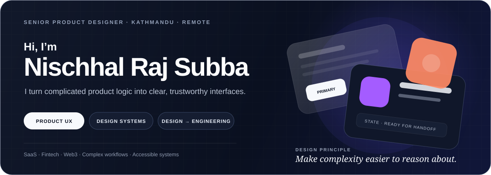
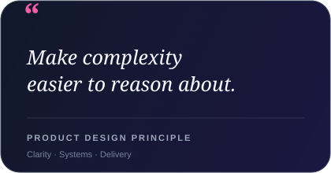
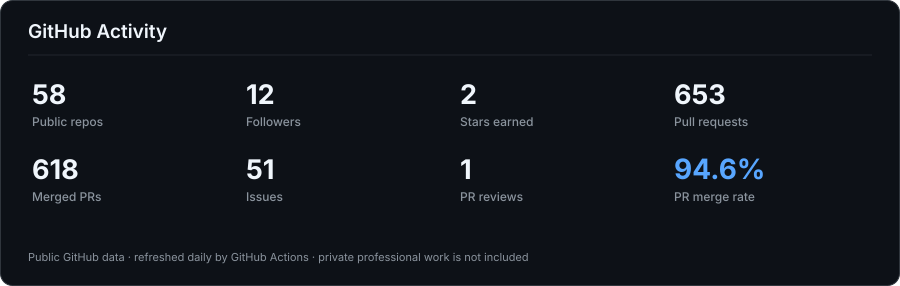
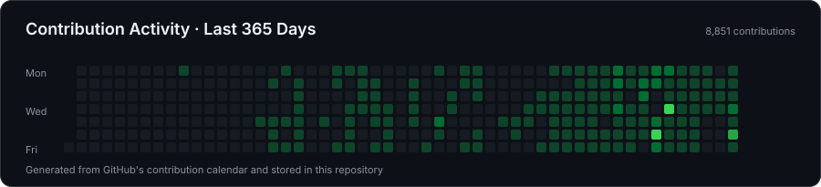
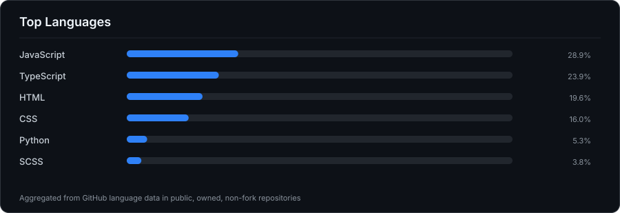
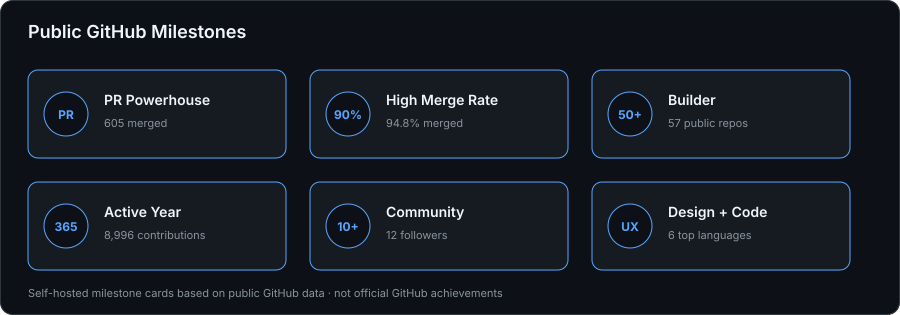
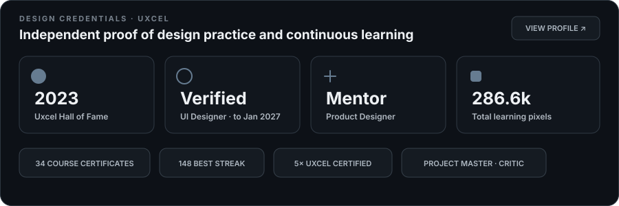

  
  
  
  

  
  
  
  
  

---

<table>
<tr>
<td width="66%" valign="top">

### Designing for products that get complicated

I’m **Nischhal Raj Subba**, a Senior Product Designer based in Kathmandu. My strongest work sits where products stop being simple: **multi-role workflows, permissions, dense information, high-trust actions, system states, reusable patterns, and implementation constraints**.

I work across **product strategy, UX research, information architecture, interaction design, accessible UI, prototyping, design systems, and design-to-engineering delivery**.

  
  
  
  
  
  

</td>
<td width="34%" valign="top">

</td>
</tr>
</table>

  

---

## GitHub Activity

  

  

<table>
<tr>
<td width="58%" valign="top">

</td>
<td width="42%" valign="top">

### Contribution streak

</td>
</tr>
</table>

### Public GitHub milestones

  

Core metrics, contribution graph, language stats, badges, and milestone cards are self-hosted in this repository and refreshed automatically from GitHub's API. The streak card is the only external live widget above. Public figures do not include private professional work.

---

## Selected Work

  <a href="https://github.com/Nischhalsubba/design-ops-orchestrator"><strong>DesignOps Orchestrator</strong></a>
  &nbsp;·&nbsp;
  <a href="https://github.com/Nischhalsubba/HR-Payroll-Management"><strong>HR Payroll</strong></a>
  &nbsp;·&nbsp;
  <a href="https://github.com/Nischhalsubba/Napiyo"><strong>Napiyo</strong></a>
  &nbsp;·&nbsp;
  <a href="https://github.com/Nischhalsubba/nischhalsubba.com.np"><strong>Portfolio</strong></a>

---

## Design Credentials

  <a href="https://uxcel.com/designer-rankings/past-winners"><strong>Uxcel Hall of Fame ↗</strong></a>
  &nbsp;·&nbsp;
  <a href="https://app.uxcel.com/ux/nischhal"><strong>Full Uxcel profile ↗</strong></a>

### Toolkit

  
  
  
  
  
  

---

## Writing

I write practical notes about the parts of product design that become expensive when they stay ambiguous.

- **[Web3 Wallet UX Checklist](https://nischhalsubba.com.np/blog/web3-wallet-ux-checklist)** — signing, transaction context, pending states, rejection, failure, and recovery.
- **[SaaS Dashboard UX Checklist](https://nischhalsubba.com.np/blog/saas-dashboard-ux-checklist)** — information density, tables, filters, states, permissions, and responsive behavior.
- **[Figma Handoff Notes for Developers](https://nischhalsubba.com.np/blog/figma-handoff-notes-for-developers)** — behavior, edge cases, accessibility, breakpoints, and acceptance criteria.
- **[Design Handoff Checklist for Startup Product Teams](https://nischhalsubba.com.np/blog/design-handoff-checklist-startup-product-teams)** — a practical handoff framework for product teams.

<a href="https://nischhalsubba.com.np/blog/"><strong>Read all writing →</strong></a>

---

**[Portfolio](https://nischhalsubba.com.np/)** · **[LinkedIn](https://www.linkedin.com/in/nischhal)** · **[Uxcel](https://app.uxcel.com/ux/nischhal)** · **[Behance](https://www.behance.net/nischhal)** · **[Dribbble](https://dribbble.com/Nischhal)**

Make complexity easier to reason about.

