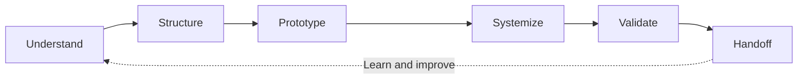

PRODUCT DESIGN · UX SYSTEMS · DESIGN-TO-DEVELOPMENT

# Nischhal Raj Subba

### Designing clear, trustworthy digital products for complex systems.

I work where product strategy, interaction design, visual systems, and implementation meet.
My focus is not only how an interface looks, but how the product thinks, behaves, scales, and earns trust.

  
  
  
  

  
  
  

 

> **I design the logic behind the interface, not only the surface in front of it.**

## What I bring to a product

<table>
<tr>
<td width="50%" valign="top">

### Product clarity

- Product strategy and problem framing
- UX research and workflow discovery
- Information architecture
- Journey mapping and interaction models
- UX audits for complex products

</td>
<td width="50%" valign="top">

### System quality

- Accessible, responsive interface design
- Design systems and component libraries
- Prototypes that explain behavior
- Design-to-development handoff
- Front-end-aware design decisions

</td>
</tr>
</table>

I am especially interested in products where users need to understand risk, data, status, permissions, dependencies, or multi-step processes without feeling buried by the interface.

---

## Selected product work

<table>
<tr>
<td width="50%" valign="top">

### [Napiyo](https://github.com/Nischhalsubba/Napiyo)

A Nepal-focused land measurement and unit conversion product built around local terminology, visual workflows, and practical product logic.

LOCAL UTILITY · INFORMATION DESIGN · PRODUCT LOGIC

</td>
<td width="50%" valign="top">

### [DesignOps Orchestrator](https://github.com/Nischhalsubba/design-ops-orchestrator)

A workflow system connecting design tokens, content, assets, accessibility checks, performance audits, and production handoff.

DESIGN SYSTEMS · AUTOMATION · DESIGN OPERATIONS

</td>
</tr>
<tr>
<td width="50%" valign="top">

### [Neverwinter Composition Lab](https://github.com/Nischhalsubba/neverwinter-composition-lab)

A planning utility focused on role clarity, information density, and support workflows for complex team compositions.

PLANNING UX · DATA DENSITY · DECISION SUPPORT

</td>
<td width="50%" valign="top">

### [Neverwinter Live Parser](https://github.com/Nischhalsubba/neverwinter-live-parser)

A desktop analytics product for interpreting combat logs, comparing performance, and turning dense data into useful decisions.

DESKTOP UX · ANALYTICS · DATA VISUALIZATION

</td>
</tr>
<tr>
<td width="50%" valign="top">

### [HR Payroll Management](https://github.com/Nischhalsubba/HR-Payroll-Management)

An employee and payroll dashboard exploring onboarding, administrative workflows, settings, and operational product UX.

SAAS · ADMIN UX · WORKFLOW DESIGN

</td>
<td width="50%" valign="top">

### [Portfolio Platform](https://github.com/Nischhalsubba/nischhalsubba.com.np)

My portfolio, writing platform, project archive, and personal brand system built around structured content and discoverability.

CONTENT SYSTEM · PERSONAL BRAND · FRONT END

</td>
</tr>
</table>

[Explore all repositories](https://github.com/Nischhalsubba?tab=repositories) · [View case studies](https://nischhalsubba.com.np/)

---

## My product design loop

```mermaid
flowchart LR
    A[Understand] --> B[Structure]
    B --> C[Prototype]
    C --> D[Systemize]
    D --> E[Validate]
    E --> F[Handoff]
    F -. Learn and improve .-> A
```

<table>
<tr>
<td width="33%" valign="top">

### 01 · Understand

Clarify the user, business goal, constraints, risks, and evidence before decorating assumptions.

</td>
<td width="33%" valign="top">

### 02 · Structure

Turn complexity into understandable journeys, states, hierarchy, content, and product rules.

</td>
<td width="33%" valign="top">

### 03 · Deliver

Prototype behavior, establish the system, validate decisions, and document implementation clearly.

</td>
</tr>
</table>

---

## Toolkit

 

<strong>View the extended toolkit</strong>

 

**Design and product**

Figma · FigJam · UX research · Information architecture · Wireframing · Prototyping · Usability testing · UX audits · Accessibility · Design systems · Content structure · Developer handoff

**Front end and content systems**

HTML · CSS · Sass · JavaScript · TypeScript · React · Next.js · Astro · GSAP · WordPress · Strapi

**Workflow**

Git · GitHub · Component documentation · Responsive QA · Accessibility reviews · Performance-aware design · Design token thinking

---

## GitHub activity

<table>
<tr>
<td width="50%" align="center">

</td>
<td width="50%" align="center">

</td>
</tr>
</table>

---

## Achievements

---

## Writing and field notes

I write practical notes for designers and builders working on complex digital products.

<table>
<tr>
<td width="50%" valign="top">

- [Web3 Wallet UX Checklist for First-Time Users](https://nischhalsubba.com.np/blog/web3-wallet-ux-checklist.html)
- [How to Design Transaction Review Screens for Crypto Apps](https://nischhalsubba.com.np/blog/transaction-review-ux-crypto-apps.html)
- [SaaS Dashboard UX Checklist for Complex Workflows](https://nischhalsubba.com.np/blog/saas-dashboard-ux-checklist.html)

</td>
<td width="50%" valign="top">

- [Website UX Checklist for Software Companies](https://nischhalsubba.com.np/blog/website-ux-checklist-software-companies.html)
- [UX Audit Checklist Before Redesigning a Website](https://nischhalsubba.com.np/blog/ux-audit-checklist-before-redesign.html)
- [How to Write Developer Handoff Notes in Figma](https://nischhalsubba.com.np/blog/figma-handoff-notes-for-developers.html)

</td>
</tr>
</table>

[Read all articles](https://nischhalsubba.com.np/blog/)

---

## Principles I design by

> **Clarity before cleverness. Useful before decorative. Systems over one-off screens.**

- Make complex workflows understandable without hiding important detail.
- Build trust through clear language, predictable behavior, and visible system status.
- Treat accessibility and responsive behavior as product requirements.
- Design components as part of a system, not as isolated screenshots.
- Document decisions so the implementation remains coherent.
- Present work honestly, including context, tradeoffs, and constraints.

---

### Design clearly. Build thoughtfully.

<a href="https://nischhalsubba.com.np/">Portfolio</a> ·
<a href="https://www.linkedin.com/in/nischhal">LinkedIn</a> ·
<a href="https://www.behance.net/nischhal">Behance</a> ·
<a href="https://app.uxcel.com/ux/nischhal">Uxcel</a> ·
<a href="https://github.com/Nischhalsubba?tab=repositories">Repositories</a>

