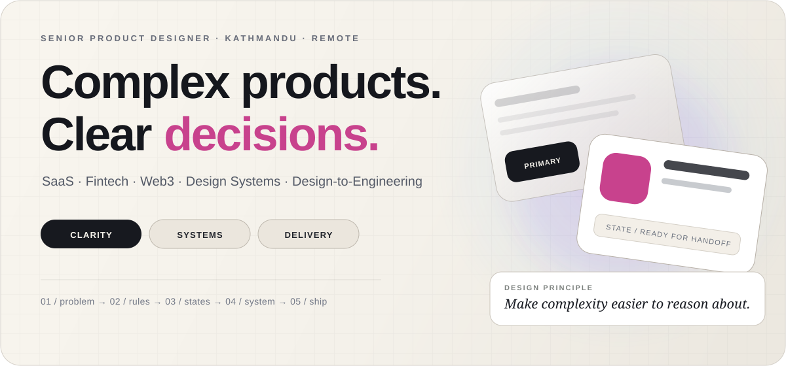

# Nischhal Raj Subba

### Product Designer · UI/UX Designer · Design Systems · Front-End-Aware Product Design

**I design clear, trustworthy digital products for complex workflows.**

  
  
  
  

  
  
  
  

<a href="https://nischhalsubba.com.np/">
  <picture>
    <source media="(prefers-color-scheme: dark)" srcset="./profile/designer-hero-dark.svg">
    <source media="(prefers-color-scheme: light)" srcset="./profile/designer-hero-light.svg">
    
  </picture>
</a>

  <a href="#featured-work"><kbd>Featured Work</kbd></a>
  <a href="#capabilities"><kbd>Capabilities</kbd></a>
  <a href="#toolkit"><kbd>Toolkit</kbd></a>
  <a href="#writing"><kbd>Writing</kbd></a>
  <a href="#github-activity"><kbd>GitHub Stats</kbd></a>
  <a href="#contact"><kbd>Contact</kbd></a>

---

## About

I am a **Product Designer with 5+ years of experience** working across SaaS, fintech, Web3, dashboards, operations software, data-heavy tools, responsive websites, and design systems.

My work connects **product strategy, UX research, information architecture, interaction design, accessible UI, prototyping, design systems, and developer handoff**. Front-end knowledge helps me make design decisions that are practical to build, easier to document, and more resilient once shipped.

> **Current focus:** complex workflows, trustworthy interfaces, scalable design systems, data-heavy products, and stronger continuity between design and implementation.

---

## Featured Work

<table>
<tr>
<td width="50%" valign="top">

### [Napiyo](https://github.com/Nischhalsubba/Napiyo)
**Localized product UX · Land measurement · TypeScript**

A Nepal-focused land measurement product shaped around local terminology, practical conversions, and everyday property-measurement workflows.

</td>
<td width="50%" valign="top">

### [DesignOps Orchestrator](https://github.com/Nischhalsubba/design-ops-orchestrator)
**Design systems · Accessibility · Production handoff**

A connected workflow for design tokens, components, accessibility, implementation quality, and developer handoff.

</td>
</tr>
<tr>
<td width="50%" valign="top">

### [The Masterwork Vault](https://github.com/Nischhalsubba/The-Masterwork-Vault)
**Information architecture · Dense data UX · TypeScript**

A Neverwinter crafting knowledge system for recipes, ingredients, professions, item outputs, requirements, and source-aware data.

</td>
<td width="50%" valign="top">

### [Neverwinter Live Parser](https://github.com/Nischhalsubba/neverwinter-live-parser)
**Real-time analytics · Data hierarchy · Desktop UX**

A live combat analytics experience that turns dense game data into summaries and signals players can interpret quickly.

</td>
</tr>
<tr>
<td width="50%" valign="top">

### [HR Payroll Management](https://github.com/Nischhalsubba/HR-Payroll-Management)
**Enterprise UX · Permissions · Operations workflows**

An HR operations product exploring employee administration, onboarding, permissions, attendance-related workflows, and payroll management.

</td>
<td width="50%" valign="top">

### [nischhalsubba.com.np](https://github.com/Nischhalsubba/nischhalsubba.com.np)
**Portfolio · Product storytelling · Front-end implementation**

My portfolio and writing platform, connecting product design case studies, UX thinking, visual systems, and implementation work.

</td>
</tr>
</table>

  <a href="https://github.com/Nischhalsubba?tab=repositories"><strong>Explore all repositories →</strong></a>

---

## Capabilities

| Product Strategy & UX | Interaction & Interface | Systems & Delivery |
|---|---|---|
| Product strategy UX research Problem framing Journey mapping Information architecture UX audits | User flows Wireframing Prototyping Interaction design Responsive behavior Accessibility | Design systems Design tokens Component logic Developer handoff Responsive QA Front-end collaboration |

**How I tend to work:** clarity before decoration, explicit states and recovery paths, reusable systems over isolated screens, and documentation that survives handoff.

---

## Toolkit

  
  
  
  
  
  
  
  

**Design:** Figma · FigJam · UX research · Product strategy · Information architecture · Wireframing · Prototyping · Usability testing · Accessibility · Design systems

**Implementation:** HTML · CSS · Sass · JavaScript · TypeScript · React · Next.js · Astro · GSAP · WordPress · Strapi

**Delivery:** Git · GitHub · Design tokens · Component documentation · Responsive QA · Accessibility reviews · Performance-aware design · Developer handoff

---

## Writing

- **[Web3 Wallet UX Checklist](https://nischhalsubba.com.np/blog/web3-wallet-ux-checklist.html)** — onboarding, signing, risk, recovery, fees, and transaction clarity.
- **[SaaS Dashboard UX Checklist](https://nischhalsubba.com.np/blog/saas-dashboard-ux-checklist.html)** — navigation, hierarchy, states, data density, filters, actions, and operational clarity.
- **[Figma Handoff Notes](https://nischhalsubba.com.np/blog/figma-handoff-notes-for-developers.html)** — behavior, states, breakpoints, accessibility, and implementation intent.

  <a href="https://nischhalsubba.com.np/blog/"><strong>Read all articles →</strong></a>

---

## GitHub Activity

The stats stay. Vanity metrics are not a substitute for good work, naturally, but they are useful context when they are kept readable.

### Contribution activity

### Profile summary

  

<table>
<tr>
<td width="50%" align="center">
  
</td>
<td width="50%" align="center">
  
</td>
</tr>
<tr>
<td width="50%" align="center">
  
</td>
<td width="50%" align="center">
  
</td>
</tr>
</table>

### Contribution animation

<a href="https://github.com/Nischhalsubba?tab=contributions">
  <picture>
    <source media="(prefers-color-scheme: dark)" srcset="https://raw.githubusercontent.com/Nischhalsubba/Nischhalsubba/output/github-contribution-grid-snake-dark.svg">
    <source media="(prefers-color-scheme: light)" srcset="https://raw.githubusercontent.com/Nischhalsubba/Nischhalsubba/output/github-contribution-grid-snake.svg">
    
  </picture>
</a>

---

## Contact

### Let us make complex products easier to understand.

  
  
  

**[Portfolio](https://nischhalsubba.com.np/)** · **[Behance](https://www.behance.net/nischhal)** · **[LinkedIn](https://www.linkedin.com/in/nischhal)** · **[Uxcel](https://app.uxcel.com/ux/nischhal)** · **[X](https://x.com/imnischhal)**

