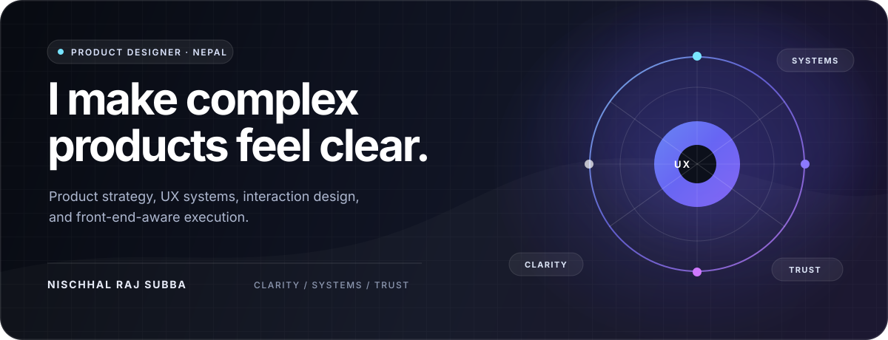

  

  <a href="https://nischhalsubba.com.np/"><strong>Portfolio ↗</strong></a>
  &nbsp;&nbsp;·&nbsp;&nbsp;
  <a href="https://www.behance.net/nischhal"><strong>Behance ↗</strong></a>
  &nbsp;&nbsp;·&nbsp;&nbsp;
  <a href="https://www.linkedin.com/in/nischhal"><strong>LinkedIn ↗</strong></a>
  &nbsp;&nbsp;·&nbsp;&nbsp;
  <a href="https://app.uxcel.com/ux/nischhal"><strong>Uxcel ↗</strong></a>

  
  
  

 

<table>
<tr>
<td width="64%" valign="top">

## A designer who thinks beyond the screen

I design digital products where **clarity, trust, and system behavior** matter as much as visual polish.

My work moves from product framing and information architecture to interaction design, visual systems, prototyping, and design-to-development handoff. I care about the decisions behind an interface: what users need to understand, what the system needs to communicate, and how the experience remains coherent when the product grows.

> **The goal is not to make complexity disappear. It is to make complexity understandable.**

</td>
<td width="36%" valign="top">

### Practice

Product design  
UX systems  
Interaction design  
Design systems  
Front-end-aware execution

### Based in

Nepal · working across global products

### Best suited for

SaaS · Fintech · Web3 · Data-rich tools · Operational software

</td>
</tr>
</table>

---

## Selected product work

<table>
<tr>
<td width="50%" valign="top">

01 · LOCAL UTILITY / INFORMATION DESIGN

### [Napiyo ↗](https://github.com/Nischhalsubba/Napiyo)

A Nepal-focused land measurement product that translates local terminology and conversion logic into a clear, practical user experience.

**Design focus:** product logic, information hierarchy, local context, utility UX

</td>
<td width="50%" valign="top">

02 · DESIGN OPERATIONS / SYSTEMS THINKING

### [DesignOps Orchestrator ↗](https://github.com/Nischhalsubba/design-ops-orchestrator)

A workflow concept connecting design tokens, content, assets, accessibility, performance, and production handoff into one operating system.

**Design focus:** workflow design, systems architecture, design-to-code operations

</td>
</tr>
<tr>
<td width="50%" valign="top">

03 · ANALYTICS / COMPLEX DATA

### [Neverwinter Live Parser ↗](https://github.com/Nischhalsubba/neverwinter-live-parser)

A desktop analytics experience for interpreting dense combat data, comparing performance, and helping users find meaningful signals quickly.

**Design focus:** data visualization, hierarchy, desktop UX, decision support

</td>
<td width="50%" valign="top">

04 · OPERATIONS / ADMIN EXPERIENCE

### [HR Payroll Management ↗](https://github.com/Nischhalsubba/HR-Payroll-Management)

An employee and payroll platform exploring onboarding, permissions, administration, settings, and everyday operational workflows.

**Design focus:** enterprise UX, forms, permissions, dashboards, workflow clarity

</td>
</tr>
</table>

  <a href="https://github.com/Nischhalsubba?tab=repositories"><strong>Explore all repositories →</strong></a>

---

## How I shape a product

| 01 · Frame | 02 · Structure | 03 · Make tangible | 04 · Ship coherently |
|---|---|---|---|
| Clarify the problem, user, risk, constraints, and desired outcome. | Organize flows, information, states, permissions, and system behavior. | Prototype interactions and visual direction early enough to challenge assumptions. | Build reusable patterns, document decisions, and support implementation quality. |

 

<table>
<tr>
<td width="33%" valign="top">

### Product clarity

Problem framing  
UX research  
Journey mapping  
Information architecture  
UX audits

</td>
<td width="33%" valign="top">

### Interaction quality

User flows  
Wireframes  
Prototypes  
Responsive behavior  
Accessibility

</td>
<td width="34%" valign="top">

### System continuity

Design systems  
Component logic  
Content structure  
Developer handoff  
Front-end collaboration

</td>
</tr>
</table>

<strong>Working toolkit</strong>

 

**Design and product**  
Figma · FigJam · UX research · Information architecture · Wireframing · Prototyping · Usability testing · UX audits · Accessibility · Design systems · Content structure

**Front end and content systems**  
HTML · CSS · Sass · JavaScript · TypeScript · React · Next.js · Astro · GSAP · WordPress · Strapi

**Delivery and quality**  
Git · GitHub · Component documentation · Responsive QA · Accessibility reviews · Performance-aware design · Design tokens · Developer handoff

---

## Writing and field notes

<table>
<tr>
<td width="33%" valign="top">

TRUST & ONBOARDING

### [Web3 wallet UX checklist ↗](https://nischhalsubba.com.np/blog/web3-wallet-ux-checklist.html)

Practical checks for helping first-time users understand wallet setup, risk, recovery, and transactions.

</td>
<td width="33%" valign="top">

COMPLEX WORKFLOWS

### [SaaS dashboard UX checklist ↗](https://nischhalsubba.com.np/blog/saas-dashboard-ux-checklist.html)

A structured review of hierarchy, navigation, states, data density, actions, and operational clarity.

</td>
<td width="34%" valign="top">

DESIGN DELIVERY

### [Figma handoff notes ↗](https://nischhalsubba.com.np/blog/figma-handoff-notes-for-developers.html)

A practical framework for documenting behavior, states, responsive rules, and implementation intent.

</td>
</tr>
</table>

  <a href="https://nischhalsubba.com.np/blog/"><strong>Read all articles →</strong></a>

---

## GitHub activity

  Design work often lives outside GitHub. The engineering trail lives here.

<table>
<tr>
<td width="50%" align="center">

</td>
<td width="50%" align="center">

</td>
</tr>
</table>

<strong>View GitHub achievements</strong>

 

  

---

## Principles I design by

<table>
<tr>
<td width="50%" valign="top">

**Clarity before cleverness**  
Interfaces should help people understand what is happening, what matters, and what they can do next.

**Trust is designed through details**  
Language, feedback, permissions, state changes, and error recovery all shape confidence.

</td>
<td width="50%" valign="top">

**Systems beat isolated screens**  
Components, content, behavior, and implementation rules should reinforce one another.

**Useful work deserves honest storytelling**  
Good case studies explain the problem, constraints, tradeoffs, decisions, and outcomes.

</td>
</tr>
</table>

---

AVAILABLE FOR THOUGHTFUL PRODUCT AND DESIGN COLLABORATIONS

## Let’s make complex products easier to understand.

<a href="https://nischhalsubba.com.np/"><strong>View portfolio</strong></a>
&nbsp;&nbsp;·&nbsp;&nbsp;
<a href="https://www.linkedin.com/in/nischhal"><strong>Connect on LinkedIn</strong></a>
&nbsp;&nbsp;·&nbsp;&nbsp;
<a href="https://www.behance.net/nischhal"><strong>Browse design work</strong></a>

  

Designed and maintained by Nischhal Raj Subba.

